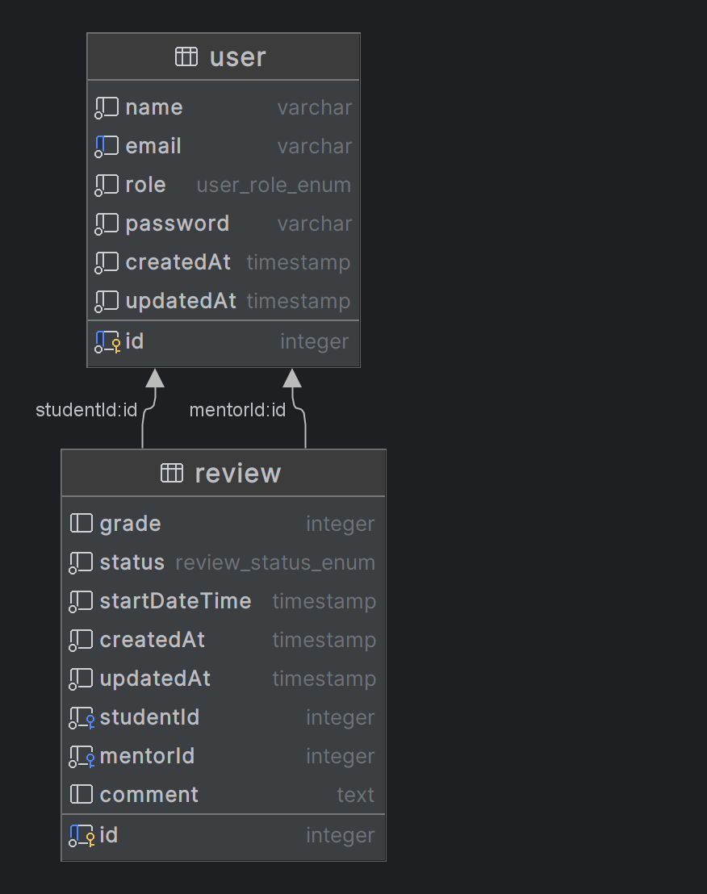

## Description

Assignment for Turing College interview. REST API to handle user and review entities.

| Endpoint                      | Admin | Mentor | Student | Description                                                                             |
|-------------------------------|-------|--------|---------|-----------------------------------------------------------------------------------------|
| POST /auth                    | +     | +      | +       | Authentication endpoint to get JWT token                                                |
| POST /users                   | +     | -      | -       | Endpoint to create a user                                                               |
| POST /users/available-mentors | -     | -      | +       | Endpoint for students to find available mentors                                         |
| POST /reviews                 | -     | -      | +       | Endpoint for Students to schedule review session                                        |
| GET /reviews                  | +     | +      | +       | Endpoint for Admin to get all reviews and for students and mentors to get their reviews |
| GET /reviews/users/:userId    | +     | -      | -       | Endpoint for Admin to get all reviews for specific user                                 |
| PATCH /reviews/:id/cancel     | -     | +      | +       | Endpoint for Students and Mentors to cancel their reviews until review has started      |
| PATCH /reviews/:id/complete   | -     | +      | -       | Endpoint for Mentors to complete their and provide grade with feedback                  |
| PATCH /reviews/:id/start      | -     | +      | -       | Endpoint for Mentors to start their review if the scheduled time has come               |

Postman Collection for playing with API can be found here https://www.postman.com/donatasdaubar/workspace/turing-college-assignment

Swagger is available on http://localhost:8080/swagger/ when starting the application.

## Design Explanations

### Authentication
Requests are authenticated with jwt tokens provided in Authorization Header with Bearer prefix.
Public endpoints are marked with @Public decorator.
Role specific endpoints are marked with @Roles decorator. Passwords are hashed using bcrypt.

### Seeding and Migrations
Seeding is done in bootstrap script, using seeder module.
Skipping seeding or enabling seeding can be done with .env variables (0 - disabled, 1 - enabled)
* SEED_USERS_ENABLED
* SEED_REVIEWS_ENABLED

Didn't create TypeORM migration files using typeorm cli. However, synchronization should be sufficient to create needed tables
when starting the application.

### Table Structure
Students, Mentors and Admins are stored in user table. This user type is persisted in role column.

Reviews are stored in review table. Columns mentorId and studentId captures participants of the review and are foreign keys for user.id column.
endDateTime column was added to simplify check for conflicting mentor sessions.



### REST API Design

#### Get All reviews or self reviews
Combined retrieval of reviews for all user roles by using GET /reviews. Admin users will get all review, where mentors and
students only their reviews. There were some thoughts to create filtering by query parameters in example /users?mentorId=
or /users?studentId= ,but decided to go with this approach, as this doesn't require additional checks for provided query parameter.
(similar reasoning for above)

#### Get reviews by user
Finding reviews by user decided to use GET /reviews/users/:userId . This seemed more natural for provided requirements.
Possibly could combine with GET /reviews?userId= , but this would require additional logic in code and role checking.

#### Create Review
Using standard REST API naming POST /reviews 

#### Managing Review Status
Creating PATCH reviews/:id/start, PATCH reviews/:id/complete and PATCH reviews/:id/cancelled, rather than having single /reviews/:id endpoint
seemed more natural rather than just having single endpoint that handles all the status transition. This was due to different
permissions per role, different body payload per status change.

#### Finding Available Mentors
Didn't find a way to fit naming REST API naming so chose to name GET /users/available-mentors?startDateTime=

#### Creating Users
Wasn't required in assignment, but created POST /users in case additional users are needed for testing/playing around with the API

## Application Startup Instructions

### Installation

```bash
# Setup .env file
$ cp .env.example .env
# Setup dependencies
$ npm install
```

### Running Postgres database

```bash
# Running postgres without api
docker-compose up --scale api=0
```

### Running Application

```bash
# development
$ npm run start
```

### Test

```bash
# unit tests
$ npm run test

# e2e tests
$ npm run test:e2e

# test coverage
$ npm run test:cov
```

### Running Application with Docker Compose
```bash
docker-compose up
```